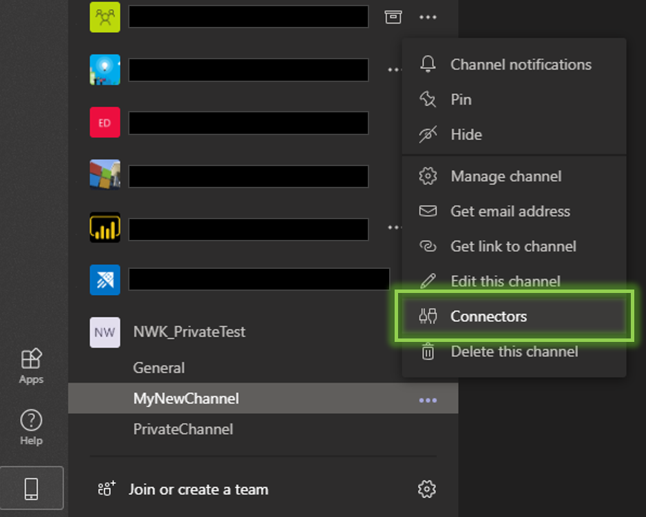

# demo_teams_webhook_message_py
Sample code to send a message to Microsoft Teams via a configured webhook

### Configuring a Teams Webhook inside an existing channel

1.) Click the '...' menu button to the right of your channel, and select 'Connectors'

2.) Scroll to 'Incoming Webhook' and click 'Configure'

3.) Give your new webhook a name, and click 'Create'

4.) Save the webhook URL.

5.) Use the webhook URL to post messages inside your channel as shown in the jupyter notebook in this repo.

